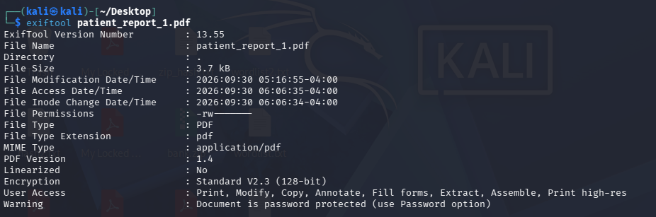
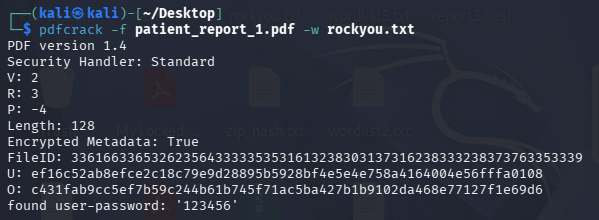
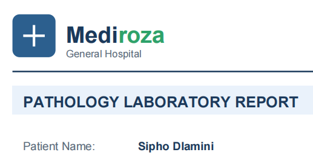
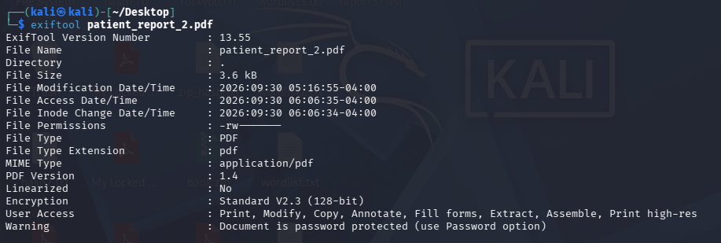
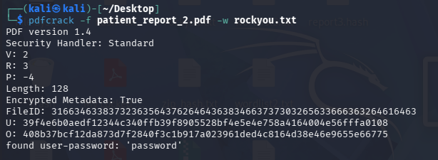
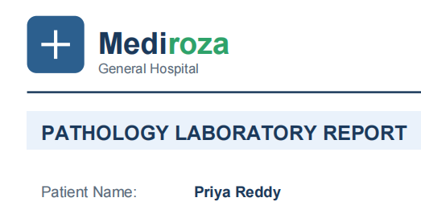
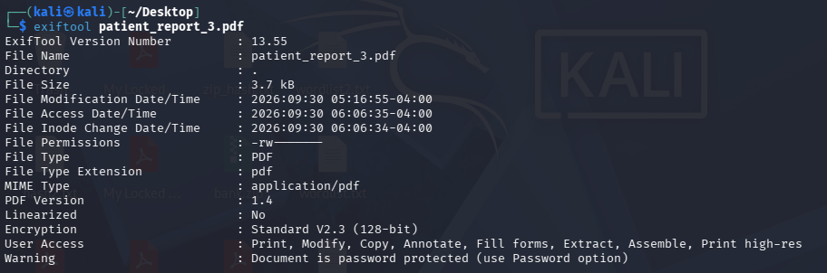
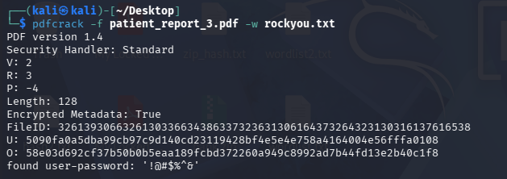
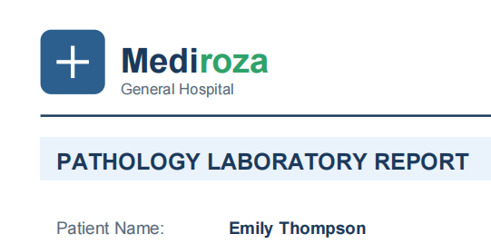

# Milestone 2 — Cracking the Encryption

**Project:** Penetration Testing Project — Mediroza General Hospital
**Batch:** B083 | Week 4
**Target:** https://medirozahospital.com
**Author:** Zain ul Abidin
**Authorization:** Written permission granted (Black-box Pentest, NetworkWalks)

---

## Objective

Crack the encryption on all 3 confidential patient PDF lab reports retrieved in Milestone 1, and recover their contents.

---

## Methodology

For each file the following approach was used:

1. Extract file metadata with `exiftool` to check for any useful information (author, creation tool, timestamps).
2. Calculate a SHA256 hash of the original file for evidence/integrity purposes.
3. Attempt to crack the PDF's user password with `pdfcrack` using the `rockyou.txt` wordlist.
4. If the standard wordlist failed, a targeted/custom wordlist was tried.
5. Once cracked, the file was opened with the recovered password to confirm and record its contents.

---

## File 1 — patient_report_1.pdf

### Metadata

```bash
exiftool patient_report_1.pdf
```



### File Hash

```bash
sha256sum patient_report_1.pdf
```

`SHA256: <ceb0a84ad92f811c281f5cdb6dd207686c80a1f7c17552a08282461c7df99d86>`

### Password Cracking

```bash
pdfcrack -f patient_report_1.pdf -w rockyou.txt
```



**Recovered password:** `<123456>`

### Opened Result



---

## File 2 — patient_report_2.pdf

### Metadata

```bash
exiftool patient_report_2.pdf
```



### File Hash

```bash
sha256sum patient_report_2.pdf
```

`SHA256: <0358b28270cc5b495df3ed5f98ed371510deaadcaa8256e6158837642d67a1b2>`

### Password Cracking
```bash
pdfcrack -f patient_report_2.pdf -w rockyou.txt
```



**Recovered password:** `<password>`

### Opened Result



---

## File 3 — patient_report_3.pdf

### Metadata

```bash
exiftool patient_report_3.pdf
```



### File Hash

```bash
sha256sum patient_report_3.pdf
```

`SHA256: <fb4ec0e38b5ad4647543cdb60d81224adf05b77d6ebd24cddbc2df6d510fd403 >`

### Password Cracking

```bash
pdfcrack -f patient_report_3.pdf -w rockyou.txt
```



**Recovered password:** `<!@#$%^&>`

### Opened Result



---

## Summary

| File | Password Recovered | Method |
|---|---|---|
| patient_report_1.pdf | `<123456>` | `<rockyou / custom wordlist>` |
| patient_report_2.pdf | `<password>` | `<rockyou / custom wordlist>` |
| patient_report_3.pdf | `<!@#$%^&>` | `<rockyou / custom wordlist>` |

## Deliverable

✅ Recovered contents of all 3 encrypted PDF files with proof of successful access (metadata, cracking output, and decrypted content screenshots for each file).
