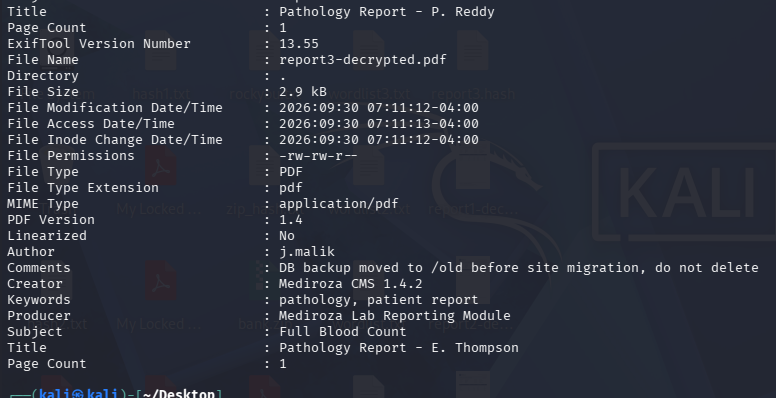
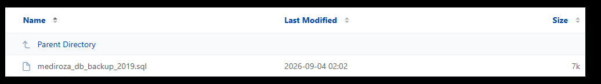
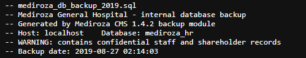

# Milestone 3 — Critical Data Exposure on the Client Server

**Project:** Penetration Testing Project — Mediroza General Hospital
**Batch:** B083 | Week 4
**Target:** https://medirozahospital.com
**Author:** Zain ul Abidin
**Authorization:** Written permission granted (Black-box Pentest, NetworkWalks)

---

## Objective

Conduct a thorough analysis of everything retrieved so far, identify a further critical exposure on the server, and use it to locate staff salary data and shareholder details of the hospital.

---

## Step 1 — Decrypting and Re-examining the Retrieved PDFs

The 3 PDF files retrieved in Milestone 1 and cracked in Milestone 2 were decrypted with `qpdf` and their metadata re-examined with `exiftool`, since the PDFs had returned "password protected" placeholders on the first metadata pass:

```bash
qpdf --password=123456 --decrypt patient_report_1.pdf report1-decrypted.pdf
qpdf --password=password --decrypt patient_report_2.pdf report2-decrypted.pdf
qpdf --password='!@#$%^&' --decrypt patient_report_3.pdf report3-decrypted.pdf

exiftool report1-decrypted.pdf
exiftool report2-decrypted.pdf
exiftool report3-decrypted.pdf
```

Reports 1 and 2 returned standard metadata (Author, Creator, Producer, Title). **Report 3** (`Pathology Report - E. Thompson`) contained an additional, non-standard `Comments` field left behind by a staff member:

```
Author   : j.malik
Comments : DB backup moved to /old before site migration, do not delete
```



This comment directly disclosed the existence and location of a legacy backup directory on the server.

---

## Step 2 — Probing the Disclosed Path

The disclosed path was requested directly:

```bash
curl -s "$TARGET/old/"
```

The server returned a full **directory listing** (`Index of /old/`), confirming the `/old/` directory was publicly accessible with no authentication and no access restrictions:



A single file was listed:

| Name | Last Modified | Size |
|---|---|---|
| `mediroza_db_backup_2019.sql` | 2026-09-04 02:02 | 7k |

---

## Step 3 — Retrieving the Exposed Database Backup

```bash
curl -O "$TARGET/old/mediroza_db_backup_2019.sql"
```

The file downloaded without any authentication challenge, confirming a **critical, unauthenticated data exposure**. The backup is a plaintext SQL dump of the `mediroza_hr` database, containing two tables directly relevant to the milestone's tasks: `staff` and `shareholders`.



---

## Findings

### 1. Staff Salaries (Task: Find the salaries of all hospital employees)

The `staff` table contains 30 employee records, each with full name, job title, department, email, phone number, **national ID number**, monthly salary (ZAR), and date joined.

Highlights:

| Job Title | Department | Monthly Salary (ZAR) |
|---|---|---|
| Chief Pathologist | Diagnostics Lab | 138,000 |
| Chief Financial Officer | Finance | 152,000 |
| Medical Director | Management | 160,000 |
| Consultant Cardiologist | Cardiology | 132,000 |
| HR Director | Human Resources | 96,000 |
| IT Systems Administrator | IT | 58,000 |
| Registered Nurse | Emergency & Trauma | 34,000 |
| Receptionist | Front Office | 19,000 |

*(Full 30-record dataset available in the raw `mediroza_db_backup_2019.sql` file, retained as evidence.)*

### 2. Shareholder Details (Task: Find the shareholder details of the hospital)

The `shareholders` table lists 10 shareholders with their percentage ownership, number of shares held, and share class:

| Shareholder | Share % | Shares Held | Class |
|---|---|---|---|
| Dr. Rajesh Naidoo | 18.0% | 180,000 | Ordinary |
| Cedar Health Holdings (Pty) Ltd | 15.0% | 150,000 | Ordinary |
| Dr. Johan van der Merwe | 12.0% | 120,000 | Ordinary |
| Reddy Family Trust | 11.0% | 110,000 | Ordinary |
| Thabo Molefe | 10.0% | 100,000 | Ordinary |
| Sarah Botha | 9.0% | 90,000 | Ordinary |
| Dr. Ahmed Kara | 8.0% | 80,000 | Preferential |
| Naledi Zulu | 7.0% | 70,000 | Ordinary |
| Michael Roberts | 6.0% | 60,000 | Ordinary |
| Dr. Vikram Chetty | 4.0% | 40,000 | Preferential |

---

## Root Cause

A legacy database backup was moved to a `/old` directory during a site migration instead of being securely deleted or stored outside the webroot. The directory was left with **directory-listing enabled** and **no authentication**, and the backup file itself was stored **unencrypted**. The existence of this backup was inadvertently disclosed through a leftover metadata comment embedded in one of the patient PDF reports by an internal staff member (`j.malik`).

## Impact

- Full disclosure of **all 30 staff members' salaries** and **national ID numbers**
- Full disclosure of **hospital shareholder structure and ownership percentages**
- No authentication required — any unauthenticated internet user could retrieve this file
- The exposure was discoverable purely through metadata analysis of documents the application itself served, without any active exploitation against the server

## Deliverable

✅ Full documented evidence of the exposure: metadata comment disclosure → directory listing → unauthenticated backup file download, plus a readable summary of all confidential staff salary and shareholder data uncovered.
